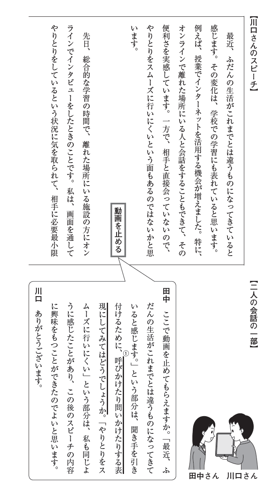
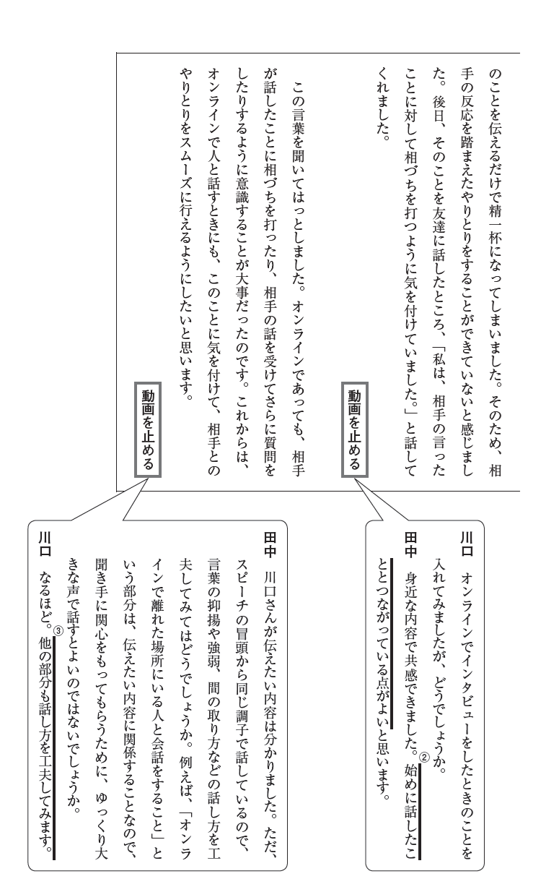
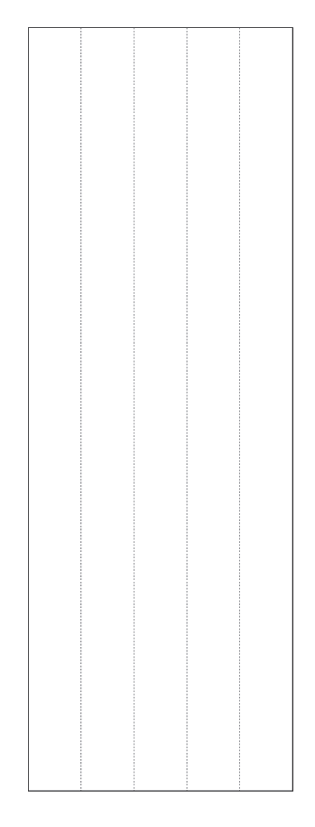
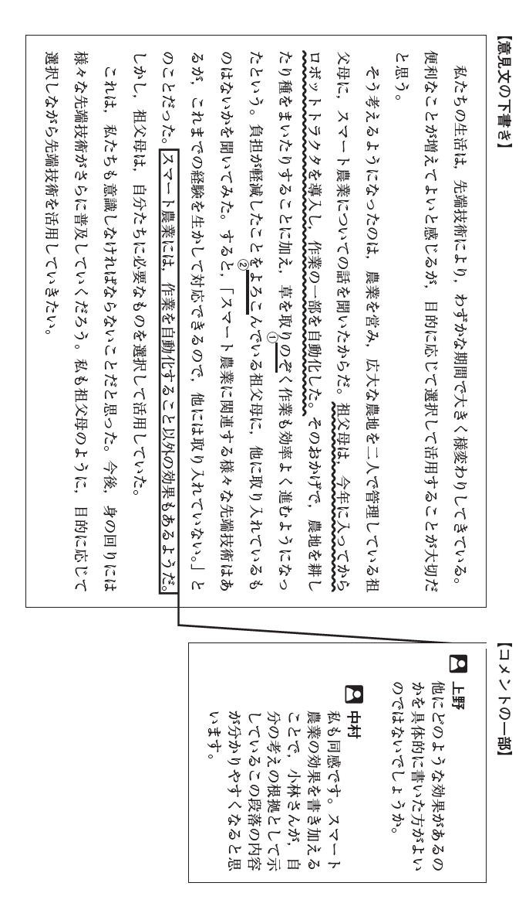
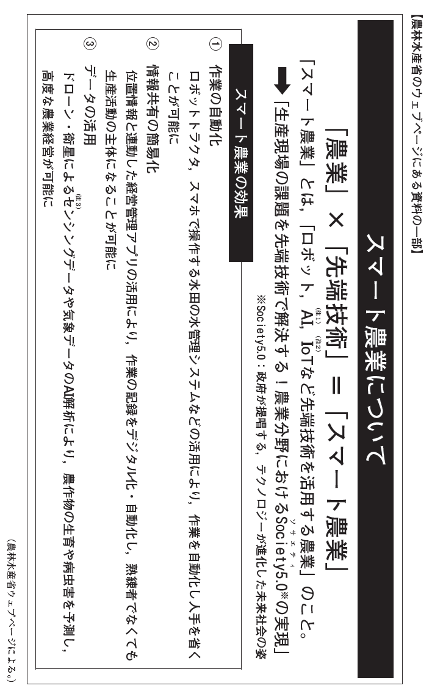
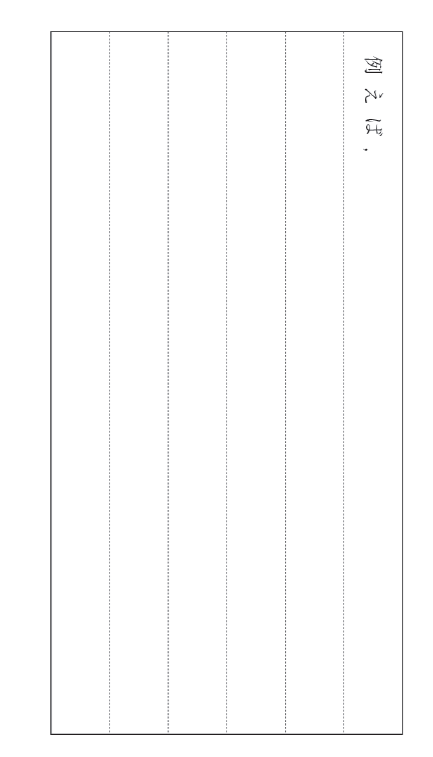
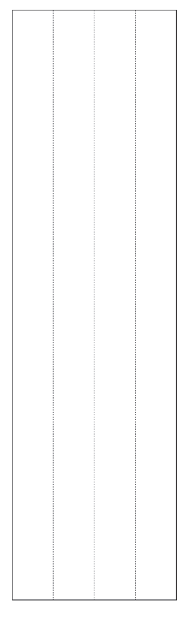
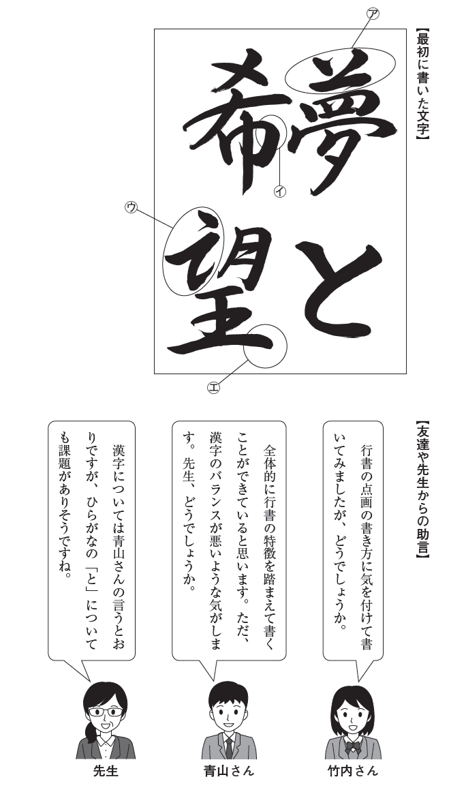
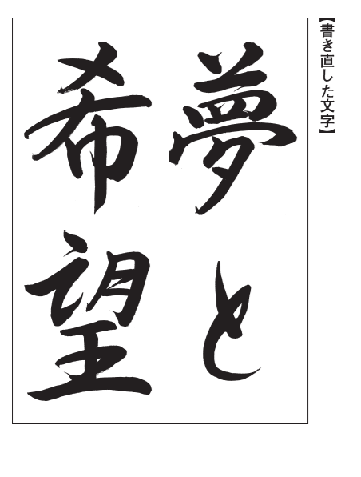

<!---
2022年度　中学校第3学年　国語
--->
# 【一】

<!---
PDFでは算用数字だがXMLで漢数字だったのでそのままにしておく
--->
　川口さんは、国語の時間に、最近気になったことについてスピーチをする学習に取り組んでいます。川口さんは、動画に自分のスピーチを記録し、それを田中さんに見せて助言をもらっています。次の【川口さんのスピーチ】と
【二人の会話の一部】を読んで、あとの問いに答えなさい。

## 一
　川口さんは、【二人の会話の一部】の----線部①「呼びかけたり問いかけたりする表現にしてみてはどうでしょうか」という田中さんからの助言を受け、「最近、ふだんの生活がこれまでとは違うものになってきていると感じます。」という部分に言葉を加えて直すことにしました。あなたならどのように直しますか。実際に話すように書きなさい。

## 二
<!--- 
XMLに脱字あり、「で」が抜けていたので補った
--->
【二人の会話の一部】で田中さんは、----線部②「始めに話したこととつながっている点がよい」と述べていますが、これを具体的に説明したものとして最も適切なものを、次の１から４までの中から一つ選びなさい。

１　インターネットの「便利さを実感」していることの例として、総合的な学習の時間での自分の経験を挙げている点がよい。

２　インターネットの「便利さを実感」していることの例として、友達が話してくれた言葉を挙げている点がよい。

３　「やりとりをスムーズに行いにくい」ということの例として、総合的な学習の時間での自分の経験を挙げている点がよい。

４　「やりとりをスムーズに行いにくい」ということの例として、友達が話してくれた言葉を挙げている点がよい。

# 三

【二人の会話の一部】に----線部③「他の部分も話し方を工夫してみます。」とありますが、あなたならどの部分をどのように工夫して話しますか。次の条件１と条件２にしたがって書きなさい。
　なお、読み返して文章を直したいときは、二本線で消したり行間に書き加えたりしてもかまいません。

条件１【川口さんのスピーチ】のどの部分をどのように工夫して話すのかについて、言葉の抑揚や強弱、間の取り方などに着目して具体的に書くこと。

条件２　条件１のように話す意図を書くこと。

※　左の枠は、下書きに使ってもかまいません。解答は必ず解答用紙に書きなさい。

# 【二】
<!---
 原文横書き、PDFを90度回転して読む必要あり、XMLが提供されていれば問題にはならないが、図の方向が問題になるかも。いったん前例に従う、つまり、回転前
--->

　小林さんは，国語の時間に，「先端技術との関わり方」というテーマで意見文を書いています。次は，文書作成ソフトを使って小林さんが書いた
【意見文の下書き】と友達が書いた【コメントの一部】，小林さんがコメントを受けて集めた【農林水産省のウェブページにある資料の一部】です。これらを読んで，あとの問いに答えなさい。

<!---
 注はスライドの外にあるとして分けた
--->
（注１）　AI＝人工知能。
（注２）　IoT（アイオーティー）＝自動車や電化製品などの様々なものがインターネットに接続されているシステム。
（注３）　センシングデータ＝センサーを利用して計測・判別し，収集した情報。

## 一
　小林さんは、【意見文の下書き】の〰〰線部の文末を「自動化したそうだ」に直すことにしました。その意図として最も適切なものを、次の１から４までの中から一つ選びなさい。

１　祖父母が否定している内容であることを明確にしようとした。

２　祖父母の話から推測した内容であることを明確にしようとした。

３　祖父母が希望している内容であることを明確にしようとした。

４　祖父母から聞いた内容であることを明確にしようとした。

## 二
　----線部①と----線部②のひらがなを漢字に直し、
<ruby><rb>楷</rb>
<rt>かい</rt>
<rb>書</rb>
<rt>しょ</rt>
</ruby>
でていねいに書きなさい。

## 三
<!--- 
問題文中、PDFで枠で囲まれたところがXMLでは空白
--->
　小林さんは、上野さんと中村さんからの【コメントの一部】を踏まえて、
 　 
で囲まれた「スマート農業には、作業を自動化すること以外の効果もあるようだ。」のすぐあとに、スマート農業の効果を書き加えることにしました。あなたならどのように書きますか。次の条件１と条件２にしたがって書きなさい。
なお、読み返して文章を直したいときは、二本線で消したり行間に書き加えたりしてもかまいません。

条件１　【農林水産省のウェブページにある資料の一部】から必要な情報を引用して書くこと。引用する部分は、かぎかっこ（「　　」）でくくること。

条件２　「例えば、」に続けて書くこと。

※　次のページの枠は、下書きに使ってもかまいません。解答は必ず解答用紙に書きなさい。

# 【三】
　次の文章は、「こどもの日浅い水辺を海にして」という俳句から想像を広げることで生まれた小説です。これを読んで、あとの問いに答えなさい。

（
<ruby><rb>堀</rb>
<rt>ほり</rt>
<rb>本</rb>
<rt>もと</rt>
<rb>裕</rb>
<rt>ゆう</rt>
<rb>樹</rb>
<rt>き</rt>
</ruby>
・
<ruby><rb>田</rb>
<rt>た</rt>
<rb>丸</rb>
<rt>まる</rt>
<rb>雅</rb>
<rt>まさ</rt>
<rb>智</rb>
<rt>とも</rt>
</ruby>
『俳句でつくる小説工房』による。）

（
<ruby><rb>堀</rb>
<rt>ほり</rt>
<rb>本</rb>
<rt>もと</rt>
<rb>裕</rb>
<rt>ゆう</rt>
<rb>樹</rb>
<rt>き</rt>
</ruby>
・
<ruby><rb>田</rb>
<rt>た</rt>
<rb>丸</rb>
<rt>まる</rt>
<rb>雅</rb>
<rt>まさ</rt>
<rb>智</rb>
<rt>とも</rt>
</ruby>
『俳句でつくる小説工房』による。）

（
<ruby><rb>堀</rb>
<rt>ほり</rt>
<rb>本</rb>
<rt>もと</rt>
<rb>裕</rb>
<rt>ゆう</rt>
<rb>樹</rb>
<rt>き</rt>
</ruby>
・
<ruby><rb>田</rb>
<rt>た</rt>
<rb>丸</rb>
<rt>まる</rt>
<rb>雅</rb>
<rt>まさ</rt>
<rb>智</rb>
<rt>とも</rt>
</ruby>
『俳句でつくる小説工房』による。）

（
<ruby><rb>堀</rb>
<rt>ほり</rt>
<rb>本</rb>
<rt>もと</rt>
<rb>裕</rb>
<rt>ゆう</rt>
<rb>樹</rb>
<rt>き</rt>
</ruby>
・
<ruby><rb>田</rb>
<rt>た</rt>
<rb>丸</rb>
<rt>まる</rt>
<rb>雅</rb>
<rt>まさ</rt>
<rb>智</rb>
<rt>とも</rt>
</ruby>
『俳句でつくる小説工房』による。）

（
<ruby><rb>堀</rb>
<rt>ほり</rt>
<rb>本</rb>
<rt>もと</rt>
<rb>裕</rb>
<rt>ゆう</rt>
<rb>樹</rb>
<rt>き</rt>
</ruby>
・
<ruby><rb>田</rb>
<rt>た</rt>
<rb>丸</rb>
<rt>まる</rt>
<rb>雅</rb>
<rt>まさ</rt>
<rb>智</rb>
<rt>とも</rt>
</ruby>
『俳句でつくる小説工房』による。）

（
<ruby><rb>堀</rb>
<rt>ほり</rt>
<rb>本</rb>
<rt>もと</rt>
<rb>裕</rb>
<rt>ゆう</rt>
<rb>樹</rb>
<rt>き</rt>
</ruby>
・
<ruby><rb>田</rb>
<rt>た</rt>
<rb>丸</rb>
<rt>まる</rt>
<rb>雅</rb>
<rt>まさ</rt>
<rb>智</rb>
<rt>とも</rt>
</ruby>
『俳句でつくる小説工房』による。）

（注１）　対峙＝向き合って立つこと。にらみ合って対立すること。

（注２）　想像力たるや＝想像力といったら。

## 一
　----線部①「陽炎みたいに揺らめきながら」に使われている表現の技法の名称を書きなさい（漢字、ひらがなのどちらでもよい。）。また、それと同じ表現の技法が用いられているものを、次の１から４までの中から一つ選びなさい。

１　〰〰線部㋐「ただ、と、おれは思う。」

２　〰〰線部㋑「ブルーシートを地面に広げ、真ん中に立てた大きなパラソルの下で涼む人。」

３　〰〰線部㋒「猫のように素早く手を出し」

４　〰〰線部㋓「もっともっと前の話だと説明する。」

## 二
　----線部②「途方に暮れた」の意味として最も適切なものを、次の１から４までの中から一つ選びなさい。

１　どうしてよいか分からなくなった

２　同じことを繰り返していた

３　なつかしくなった

４　夜になったことに気付いた

## 三
　次のＡからＣまでの「おれ」の行動や心情を、話の展開に沿って順番に並べ替えるとどのようになりますか。Ａ、Ｂ、Ｃを適切に並べ替えて書きなさい。

Ａ　昔のことについて、母と電話で押し問答をする。

Ｂ　息子の遊ぶ様子を見ながら、不意に妙ななつかしさにとらわれる。

Ｃ　息子への申し訳なさを募らせつつ、目の前の息子を頼もしく思う。

## 四
　----線部③「なるほど」とありますが、「おれ」は何を「なるほど」と思ったのですか。話の展開を取り上げて書きなさい。

なお、読み返して文章を直したいときは、二本線で消したり行間に書き加えたりしてもかまいません。

※　左の枠は、下書きに使ってもかまいません。解答は必ず解答用紙に書きなさい。

# 【四】

　竹内さんは、行書で「夢と希望」という文字を書いています。次の【最初に書いた文字】、【友達や先生からの助言】、【書き直した文字】を読んで、あとの問いに答えなさい。

## 一
　【最初に書いた文字】について、青山さんは「行書の特徴を踏まえて書くことができている」と述べていますが、その具体的な内容として最も適切なものを、次の１から４までの中から一つ選びなさい。

１　㋐の部分は、筆順の変化に気を付けて書くことができている。

２　㋑の部分は、
<ruby><rb>楷</rb>
<rt>かい</rt>
<rb>書</rb>
<rt>しょ</rt>
</ruby>
と同様に点画を直線的に書くことができている。

３　㋒の部分は、点画を省略して書くことができている。

４　㋓の部分は、点画を連続して書くことができている。

## 二
【最初に書いた文字】について、青山さんは「漢字のバランスが悪い」と述べていますが、その具体的な内容として最も適切なものを、次の１から４までの中から一つ選びなさい。

１　画数の多い「夢」が他の文字より小さい。

２　画数の少ない「希」が他の文字より大きい。

３　「望」について部首と他の部分とが離れすぎている。

４　「希」と「望」について行の中心がずれている。

## 三
　【書き直した文字】の「と」の書き方について説明したものとして最も適切なものを、次の１から４までの中から一つ選びなさい。

１　全ての線が直線的になるように意識した書き方。

２　線が連続するように意識した書き方。

３　漢字より大きくなるように意識した書き方。

４　筆圧が一定になるように意識した書き方。
