<!---
2022年度　中学校第3学年　数学 
--->
# 【１】
　42を素因数分解しなさい。

# 【２】
　連立方程式
$$ 
2x＋y＝1 \\
y＝x＋4
$$
を解きなさい。

# 【３】
　優真さんは，次の予想がいつでも成り立つかどうかについて考えています。

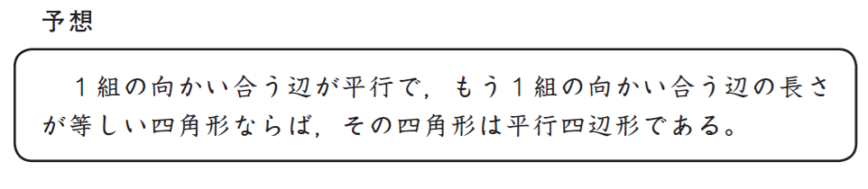
<!---
イタリックはLaTeX表示（$~$で囲む）
変数だけど通常書体のものは未処理
--->
　上の予想がいつでも成り立つかどうかを，図をかいて考えることにしました。下の図のように，はじめに，平行な2直線$l$，$m$上に3点A，B，Dをとり，線分AB，ADをかきました。次に，点Dを中心として，線分ABの長さと等しい半径の円をかいたところ，直線$m$と2点C，Eで交わり，平行四辺形になる四角形ABCDと，平行四辺形にならない四角形ABEDの2つがかけました。

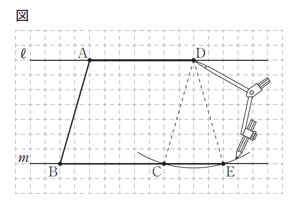

　前ページの予想がいつでも成り立つかどうかを示すことについて，正しく述べたものを，下のアからエまでの中から1つ選びなさい。

ア　予想がいつでも成り立つことを示すためには，図のように平行四辺形になる四角形ABCDが1つかければよい。

イ　予想がいつでも成り立つことを示すためには，点A，B，Dの位置を変えて，図の平行四辺形ABCDのほかに，平行四辺形になる四角形をかく必要がある。

ウ　予想がいつでも成り立つとはいえないことを示すためには，図のように平行四辺形にならない四角形ABEDが1つかければよい。

エ　予想がいつでも成り立つとはいえないことを示すためには，点A，B，Dの位置を変えて，図の四角形ABEDのほかに，平行四辺形にならない四角形をかく必要がある。

# 【４】
　下のアからエまでの表は，yがxの一次関数である関係を表しています。この中から，変化の割合が2であるものを1つ選びなさい。

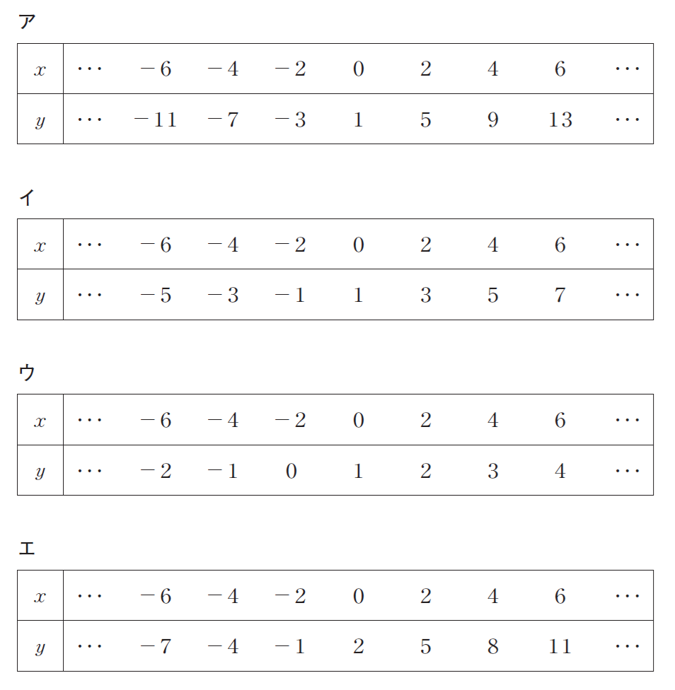

# 【５】
　右の図はある容器のふたです。このふたを多数回くり返し投げたとき，どのくらいの割合で下向きになるかを調べました。

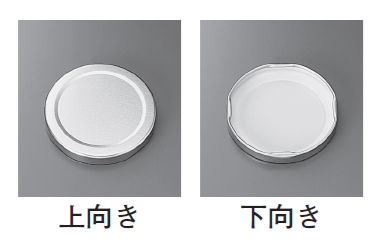

　次の表は，このふたを投げたときの下向きになった回数を記録し，下向きになる相対度数を求め，小数第3位を四捨五入してまとめたものです。

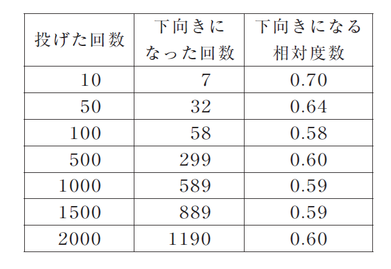

　この表をもとに，下向きになる相対度数について次の折れ線グラフに表しました。

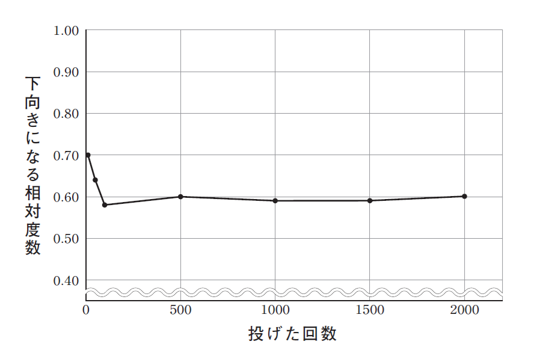

　前ページの表や折れ線グラフから，下向きになる確率がどのくらいであるかがいえます。その確率として正しいものを，下のアからエまでの中から1つ選びなさい。

ア　およそ0.5

イ　およそ0.6

ウ　およそ0.7

エ　およそ1.0

# 【６】
　康太さんは，2つの
<ruby><rb>偶</rb>
<rt>ぐう</rt>
<rb>数</rb>
<rt>すう</rt>
</ruby>
の和がどのような場合に4の倍数になるかを調べています。
$$2+2＝4$$
　　
$$4+2＝6$$
　　
$$6+2＝8$$
$$2+4＝6$$
　　
$$4+4＝8$$
　　
$$6+4＝10$$
$$2+6＝8$$
　　
$$4+6＝10$$
　　
$$6+6＝12$$

<!--- 
インラインの四則演算は平文
--->

2+2＝4，4+4＝8，6+6＝12のように，同じ2つの偶数の場合，2つの偶数の和が4の倍数になっていることから，康太さんは次のように予想しました。

上の予想1がいつでも成り立つことは，次のように説明できます。

<!--- テキストのみならばテキスト、としたので 
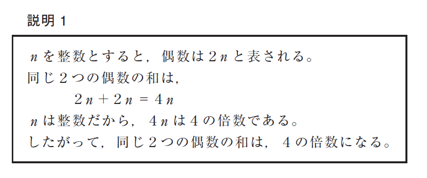
--->

　説明1

$n$を整数とすると，偶数は$2n$と表される。

同じ2つの偶数の和は，
$$2n＋2n＝4n$$
$n$は整数だから，$4n$は4の倍数である。

したがって，同じ2つの偶数の和は，4の倍数になる。

　次の（１）から（３）までの各問いに答えなさい。

<!---
$2n＋2n＝4n$
はnだけでなく全体をLaTex表記した
--->
## （１）
　前ページの
説明1
では，
$n$
を整数として，同じ2つの偶数の和を
$2n＋2n＝4n$
と表しています。この式は
$n$
の値が9のとき，どのような2つの偶数の和を表していますか。「
8＋8＝16
」，「
14＋14＝28
」のように書きなさい。

## （２）

　康太さんは，
$2＋6＝8$
のように，同じ2つの偶数の和のほかにも，4の倍数になることがあることから，さらにくわしく調べてみました。

$$2+6＝8＝4×2$$
$$6+2＝8＝4×2$$
$$10+14＝24＝4×6$$
$$28+32＝60＝4×15$$

　そして，次のように予想しました。

上の予想2がいつでも成り立つことを説明します。下の説明2を完成しなさい。
<!--- 説明2はただのテキストの枠じゃない気がする --->

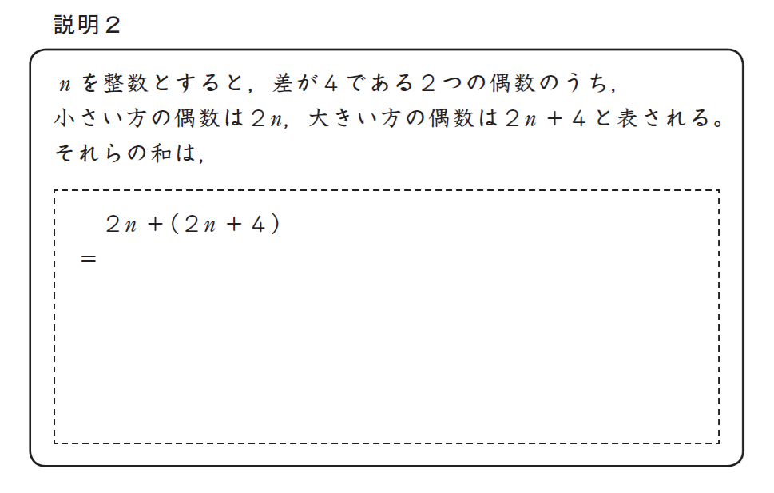

## （３）
　同じ2つの偶数の和や，差が4である2つの偶数の和のほかにも，2つの偶数の和がいつでも4の倍数になることがあります。どのような2つの偶数のとき，その2つの偶数の和が4の倍数になりますか。前ページの予想2のように，「は，……になる。」という形で書きなさい。

# 【７】
　学級でコマ回し大会をします。この大会では，次の図のようなひもを引いて回すコマを使って一人1回コマを回し，最も長い時間コマを回した人を優勝とします。

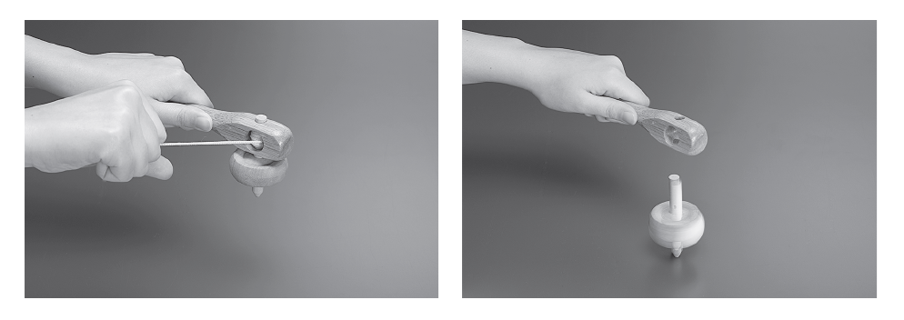

　大地さんと葉月さんは，コマAとコマBのうち，どちらのコマを使うかを検討することにしました。

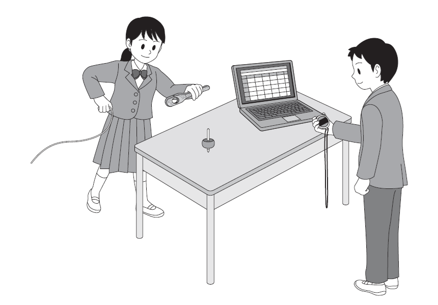

　次の（１），（２）の各問いに答えなさい。

## （１）
　二人は，どちらのコマがより長い時間回りそうかを調べるために，2つのコマを20回ずつ回し，それぞれのコマが回った時間のデータを集めました。そして，それぞれのデータについてヒストグラムをつくり，それらを比較して考えることにしました。

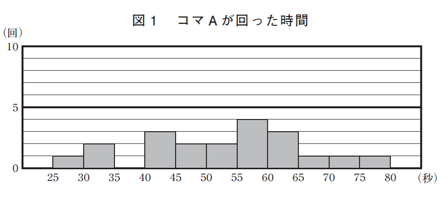
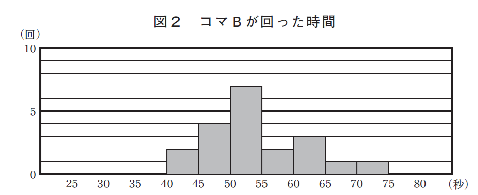

図1，図2のヒストグラムの特徴をもとに，より長い時間回りそうなコマを選ぶとすると，あなたならどちらのコマを選びますか。下のア，イの中からどちらか一方のコマを選びなさい。また，そのコマを選んだ理由を，2つのヒストグラムの特徴を比較して説明しなさい。どちらのコマを選んで説明してもかまいません。

ア　コマA

イ　コマB

##（２）

　大地さんはコマAを，葉月さんはコマBを選びました。コマを回す練習をしていた葉月さんは，コマを回す高さによって回る時間に違いがあるのではないかと考えました。そこで，次の図のように，1cmの高さを低位置，10cmの高さを中位置，20cmの高さを高位置として，それぞれの位置から20回ずつコマBを回し，コマBが回った時間のデータを位置ごとに集めました。そして，それぞれのデータの散らばりの程度を比較するために箱ひげ図をつくりました。

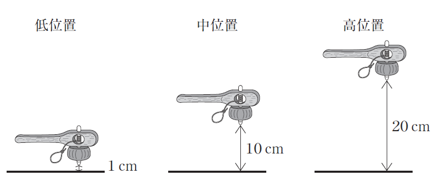
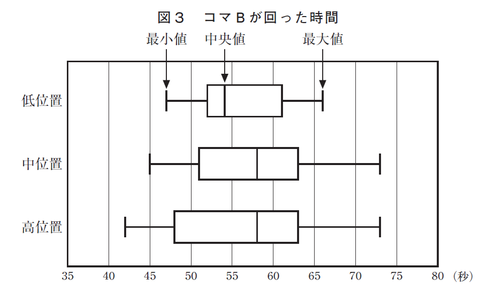

　葉月さんは，前ページの図3の箱ひげ図を比較して考えています。最大値と中央値は，低位置よりも中位置，高位置の方が大きいことから，葉月さんは低位置よりも中位置，高位置の方がより長い時間回ると判断しました。

　次に，中位置と高位置の箱ひげ図を比較すると，箱が示す区間は高位置よりも中位置の方が短いことがわかりました。

　このとき，箱が示す区間にふくまれているデータの個数と散らばりの程度について正しく述べたものを，下のアからエまでの中から1つ選びなさい。

ア　データの個数は中央値を中心とする全体の約半数であり，データの散らばりの程度は，高位置よりも中位置の方が小さい。

イ　データの個数は中央値を中心とする全体の約半数であり，データの散らばりの程度は，高位置よりも中位置の方が大きい。

ウ　データの個数は高位置よりも中位置の方が少なく，データの散らばりの程度は，高位置よりも中位置の方が小さい。

エ　データの個数は高位置よりも中位置の方が少なく，データの散らばりの程度は，高位置よりも中位置の方が大きい。

# 【８】
　愛理さんは，総合的な学習の時間に
<ruby><rb>環</rb>
<rt>かん</rt>
<rb>境</rb>
<rt>きょう</rt>
</ruby>
問題について調べています。調べたところ，世界が目指す持続可能な開発目標（
<ruby><rb>S</rb>
<rt>エス</rt>
<rb>D</rb>
<rt>ディー</rt>
<rb>G</rb>
<rt>ジー</rt>
<rb>s</rb>
<rt>ズ</rt>
</ruby>
）として，17の目標の中に「気候変動に具体的な対策を」という目標があることを知りました。

　愛理さんの学級では，この目標に対してできることがないかを話し合い，二酸化炭素の
<ruby><rb>削</rb>
<rt>さく</rt>
<rb>減</rb>
<rt>げん</rt>
</ruby>
に取り組むことにしました。取り組みの参考にするために，ほかの学校の取り組みを調べたところ，となり町の中学校のホームページをみつけました。

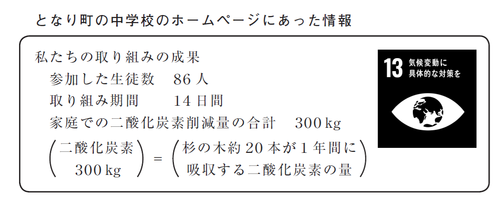

　そこで，愛理さんの学級では生徒30人で，「二酸化炭素300kgの削減」を目標とすることにしました。この学級の目標を達成するために，家庭でできる二酸化炭素削減の取り組みと削減量について調べました。

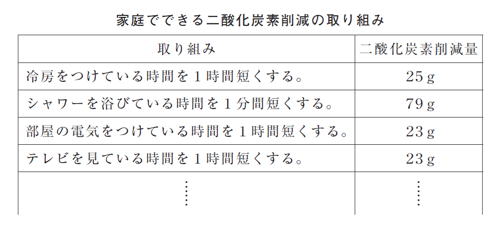

　そして，家庭でできる二酸化炭素削減の取り組みの中から，生徒それぞれの家庭でできることを選んで取り組むことにしました。その取り組みの成果について，1日ごとの学級30人分の削減量をもとに，その日までの二酸化炭素削減量の合計を記録することにしました。

　取り組みを始めた日の前日を0日目とし，$x$日目までの二酸化炭素削減量の合計を$y$kgとして，次のように表にまとめ，表の$x$と$y$
の値の組を下のグラフに表しました。

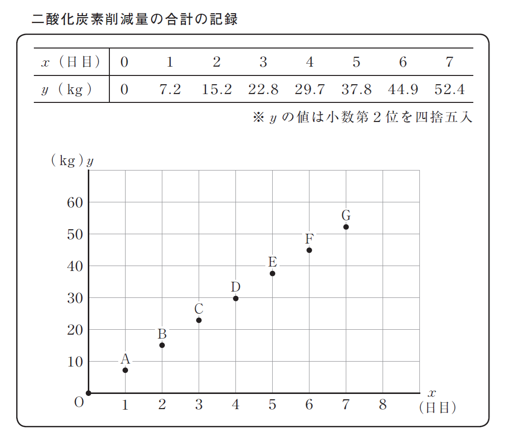

　次の（１），（２）の各問いに答えなさい。

## （１）
　二酸化炭素削減量の合計の記録のグラフにおいて，点Eの座標を書きなさい。

## （２）

　愛理さんは，7日目までの取り組みの結果から，目標を達成できるのがおよそ何日目になるかを予測することにしました。

　そこで，下の二酸化炭素削減量の合計の記録のグラフ</ref>
において，原点0から点Gまでの点が一直線上にあるとし，このまま同じように取り組みを続け，二酸化炭素削減量の合計が一定の割合で増加すると仮定して考えることにしました。

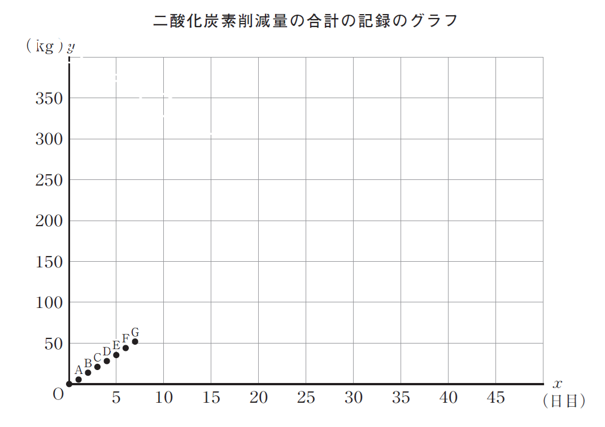

　このとき，目標の300kg削減を達成できるのがおよそ何日目になるかを求める方法を説明しなさい。ただし，実際に何日目になるかを求める必要はありません。

# 【９】

　次の図1は，長方形ABCDの外側に辺AD，DCを1辺とする正三角形ADE，DCFをかき，点Eと点B，点Bと点Fを結んだものです。

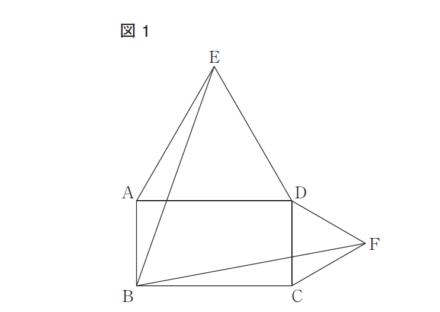

琴音さんは，線分EBと線分BFについて次のことを予想しました。

<!--- テキストのみ
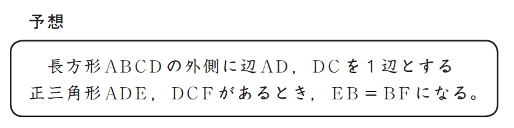
--->
予想

　長方形ABCDの外側に辺AD，DCを1辺とする正三角形ADE，DCFがあるとき，EB＝BFになる。

　次の（１），（２）の各問いに答えなさい。

## （１）

　前ページの予想が成り立つことを，次のように証明しました。

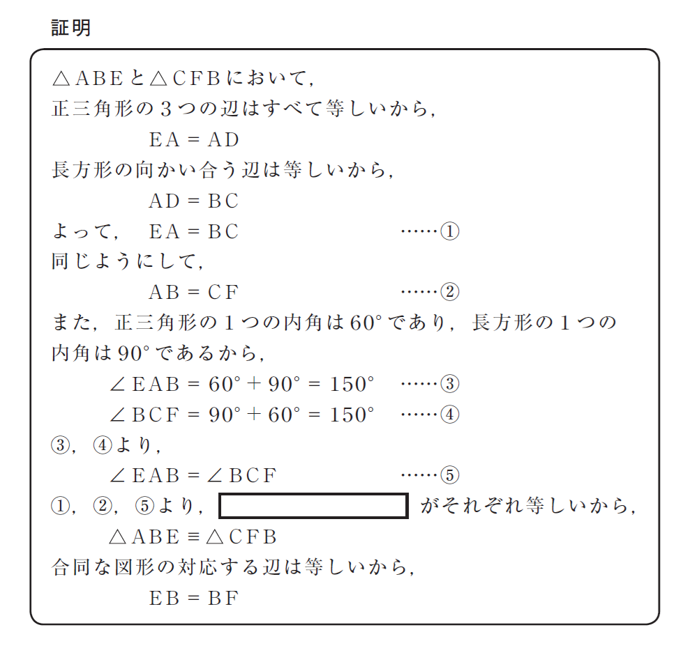

　上の証明の　に当てはまる言葉を書きなさい。

## （２）
　琴音さんは，次の図2や図3のように，21ページの図1の長方形ABCDの辺の長さをいろいろに変えた図をかきました。このときも，
△ABE≡△CFB
が成り立つので，
EB＝BF
がいえます。琴音さんは，
EB＝BF
以外にも，辺や角についていえることがないか調べました。

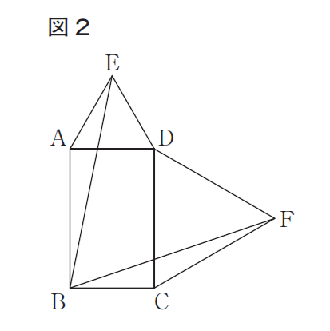
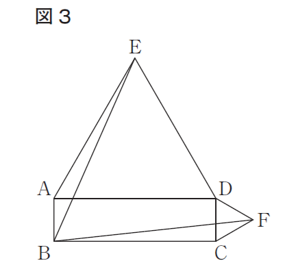

<!--- 次の文の∠EBFはもとのXMLで平文だった --->
　調べたことから，琴音さんは，長方形ABCDの辺の長さを変えても，∠EBFの大きさがいつでも60°になると予想し，次のように考えました。

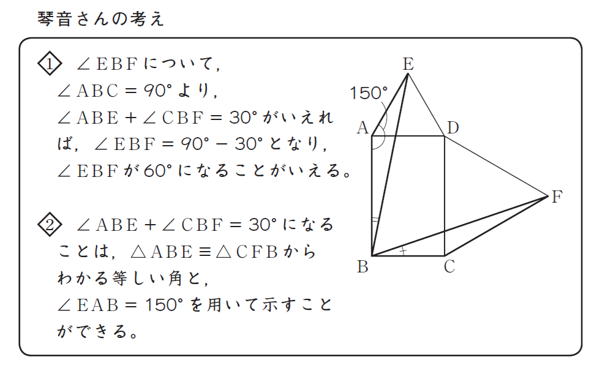

　∠ABE+∠CBF＝30°
を示すことで，長方形ABCDの辺の長さを変えても，∠EBFの大きさがいつでも60°になることが説明できます。
琴音さんの考えの２にある△ABE≡△CFBと∠EAB＝150°はすでにわかっていることとして，∠ABE+∠CBF＝30°になることを下の説明の　に示し，∠EBFの大きさがいつでも60°になることの説明を完成しなさい。

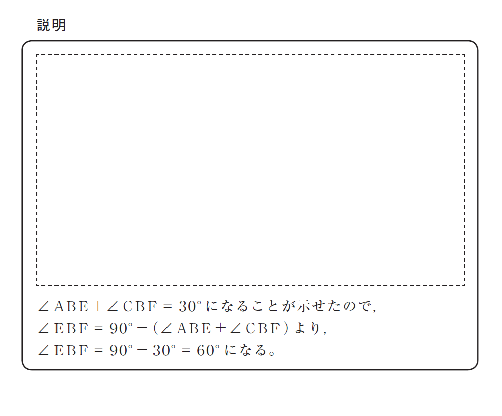
